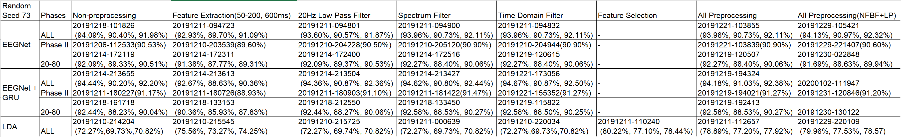
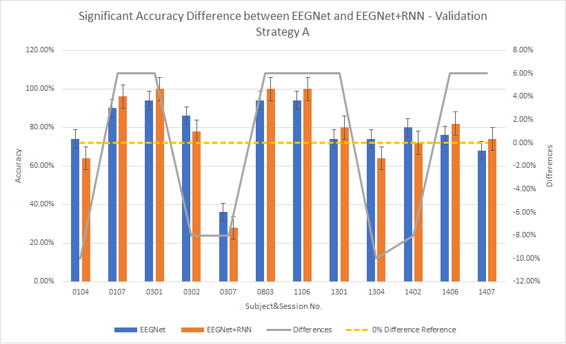
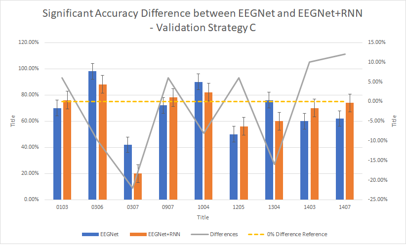

# Can Recurrent Neural Network Enhanced EEGNet Improve the Accuracy of ERP Classification Task? An Exploration and a Discussion
## Abstract
Autism Spectrum Disorder (ASD) is one of the most common developmental conditions with one in 160 children worldwide being diagnosed. Both Virtual Reality (VR) and Brain-Computer Interfaces (BCI) are believed to be beneficial to enhance communication for people with ASD. However, BCI solutions for ASD are not yet commercially available. This is partly due to the current challenge with long and fatiguing calibration sessions with conventional gel based BCI. BCI using active electrodes hold the potentials to resolve part of this issue but might increase the challenges to classification of tasks due to reduced signal quality. The dataset considered in this paper, available from the IFMBE Scientific Challenge (IFMBE SC) of 15 participants with ASD, contained data captured using electroencephalogram (EEG) headsets, from g.Nautilus system, with active electrodes in a VR environment. Known approaches, such as the Support Vector Machine (SVM), Linear Discriminant Analysis (LDA), Convolutional Neural Networks (CNN) and Long-Short Term Memory (LSTM) have demonstrated potential solutions to enhancing current algorithms.  Nevertheless, in this paper, a novel Recurrent Neural Network (RNN) solution with several pre-processing methods was introduced. Our results show that our novel RNN solution achieved 92.59\% accuracy, an improvement with 0.61 percentage point from the previously best reported algorithm during the IFMBE SC. Furthermore, with a standard 80\%-20\% initial separation strategy, our solution also generated a compatible accuracy at 89.92\%.
## Repository Structure
The scripts folder contains all classification scripts for the tasks. Please see attached list for details:

The visualisation folder contains all visualisation scripts used in the study. The output used in the paper were:

The original data was not included. Please visit website provided below for details.

## Resource Links
1. Associated publication: [10.1007/s12553-020-00458-x](http://dx.doi.org/10.1007/s12553-020-00458-x)
2. Dataset: [MEDICON2019 IFMBE Scientific Challenge](https://www.medicon2019.org/scientific-challenge/#sci_datasets)

## Algorithms Used
1. Feature Extraction: 0-600ms
2. Butterworth Low-pass Filter
3. Classification Methods:
+ Linear Discriminant Analysis
+ EEGNet
+ EEGNet + RNN
